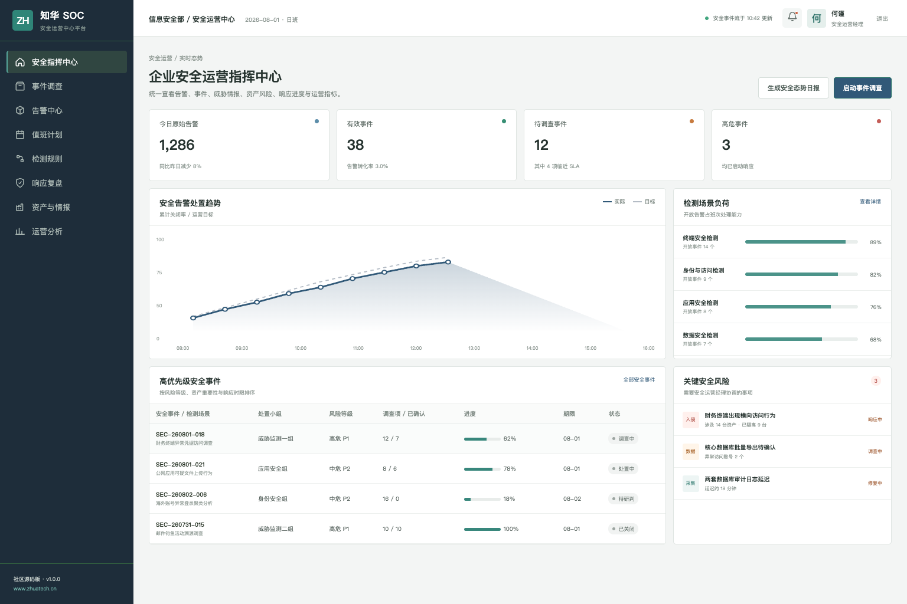
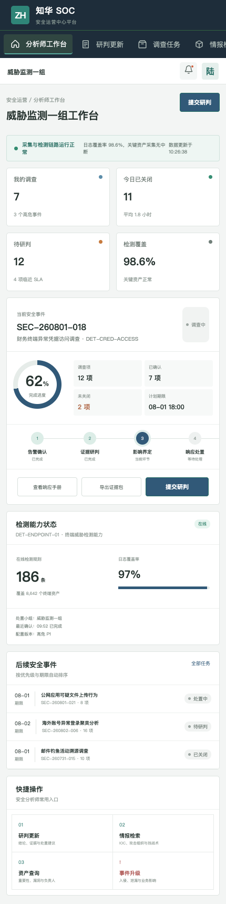

# ZhuaTech SOC

> 知华科技安全运营中心平台社区源码版

告警数量不是安全能力，能够快速形成有效判断并完成响应闭环才是。ZhuaTech SOC 将安全信号、资产上下文、威胁情报、调查证据和响应动作组织在统一工作流中。

项目由**上海如静知华信息科技有限公司**发布。官网：[https://www.zhuatech.cn/](https://www.zhuatech.cn/)

## 界面预览

**企业安全运营指挥中心**



运营经理可以观察告警转化率、事件响应进度、检测场景负荷、日志覆盖与重大安全风险。

**安全分析师 H5 工作台**



分析师可以接收调查任务、提交证据与研判、查询情报和资产，并发起重大事件升级。

## 主要模块

```text
数据接入 ──> 检测与告警 ──> 事件归并 ──> 调查研判 ──> 响应处置 ──> 复盘改进
```

- 告警中心：归并、去重、抑制、误报反馈与检测健康
- 事件调查：时间线、证据、资产、账号与攻击路径
- 威胁情报：IOC、攻击组织、漏洞和 MITRE ATT&CK 映射
- 响应协同：遏制动作、跨部门任务、通知与升级机制
- 运营度量：MTTD、MTTR、告警质量、检测覆盖和风险趋势

演示页面不包含真实告警、客户资产、漏洞或攻击数据。

## 开发环境

| 项目 | 版本与组件 |
| --- | --- |
| API | Java 21 / Spring Boot / JWT / JPA / Flyway |
| 管理端及 H5 | Vue 3 / Pinia / Vue Router / Axios / Vite |
| 存储 | MySQL 8；H2 用于自动化测试 |
| 交付 | Docker Compose / Nginx |

命名空间为 `cn.zhuatech.soc`，默认库名为 `zhuatech_soc`。

## 运行演示

```bash
cd frontend
npm install
npm run dev:demo
```

访问 `http://localhost:5173`；运营端账号 `planner / Demo@2026`，分析师端账号 `operator / Demo@2026`。API 与容器部署说明见 [docs/api.md](docs/api.md) 和 [deploy/README.md](deploy/README.md)。

## 非商业许可声明

本工程仅可用于个人学习、研究和非商业技术交流，**不得商用**。企业内部使用、生产部署、SaaS、项目交付、安全服务、收费培训、咨询实施、品牌替换或商业分发，均须获得上海如静知华信息科技有限公司书面授权。以仓库内 [LICENSE](LICENSE) 为准。

需要 SOC 建设、安全平台集成、私有化部署、检测规则开发或深度定制，请访问[知华科技官网](https://www.zhuatech.cn/)或通过微信咨询：

| 安全平台咨询 | 定制开发咨询 |
| --- | --- |
|  |  |

关键词：SOC 源码、安全运营中心、SIEM 事件管理、威胁情报、事件响应、Java SOC、Vue 安全平台、知华科技。
